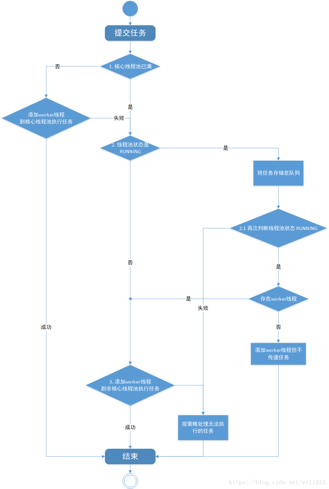

#第一章 基础知识
##1.1 java内存区域


- **方法区（Method Area）**：

	方法区属于线程共享的内存区域，又称Non-Heap（非堆），主要用于存储已被虚拟机加载的类信息、常量、静态变量、即时编译器编译后的代码等数据，根据Java 虚拟机规范的规定，当方法区无法满足内存分配需求时，将抛出`OutOfMemoryError` 异常。值得注意的是在方法区中存在一个叫运行时常量池(Runtime Constant Pool）的区域，它主要用于存放编译器生成的各种字面量和符号引用，这些内容将在类加载后存放到运行时常量池中，以便后续使用。

- **JVM堆（Java Heap）**：

	Java 堆也是属于线程共享的内存区域，它在虚拟机启动时创建，是Java 虚拟机所管理的内存中最大的一块，主要用于存放对象实例，几乎所有的对象实例都在这里分配内存，注意Java 堆是垃圾收集器管理的主要区域，因此很多时候也被称做GC 堆，如果在堆中没有内存完成实例分配，并且堆也无法再扩展时，将会抛出`OutOfMemoryError`异常。

- **程序计数器(Program Counter Register)**：

	属于线程私有的数据区域，是一小块内存空间，主要代表当前线程所执行的字节码行号指示器。字节码解释器工作时，通过改变这个计数器的值来选取下一条需要执行的字节码指令，分支、循环、跳转、异常处理、线程恢复等基础功能都需要依赖这个计数器来完成。

- **虚拟机栈(Java Virtual Machine Stacks)**：

	属于线程私有的数据区域，与线程同时创建，总数与线程关联，代表Java方法执行的内存模型。每个方法执行时都会创建一个栈桢来存储方法的的变量表、操作数栈、动态链接方法、返回值、返回地址等信息。每个方法从调用直结束就对于一个栈桢在虚拟机栈中的入栈和出栈过程。

- **本地方法栈(Native Method Stacks)**：

	本地方法栈属于线程私有的数据区域，这部分主要与虚拟机用到的 Native 方法相关，一般情况下，我们无需关心此区域。


    栈管运行，堆管存储


##1.2 java内存模型
   >Java内存模型(即Java Memory Model，简称JMM)本身是一种抽象的概念，并不真实存在，它描述的是一组规则或规范，通过这组规范定义了程序中各个变量（包括实例字段，静态字段和构成数组对象的元素）的访问方式。由于JVM运行程序的实体是线程，而每个线程创建时JVM都会为其创建一个工作内存(有些地方称为栈空间)，用于存储线程私有的数据，而Java内存模型中规定所有变量都存储在主内存，主内存是共享内存区域，所有线程都可以访问，但线程对变量的操作(读取赋值等)必须在工作内存中进行，首先要将变量从主内存拷贝的自己的工作内存空间，然后对变量进行操作，操作完成后再将变量写回主内存，不能直接操作主内存中的变量，工作内存中存储着主内存中的变量副本拷贝，前面说过，工作内存是每个线程的私有数据区域，因此不同的线程间无法访问对方的工作内存，线程间的通信(传值)必须通过主内存来完成。


   >需要注意的是，JMM与Java内存区域的划分是不同的概念层次，更恰当说JMM描述的是一组规则，通过这组规则控制程序中各个变量在共享数据区域和私有数据区域的访问方式，JMM是围绕原子性，有序性、可见性展开的(稍后会分析)。JMM与Java内存区域唯一相似点，都存在共享数据区域和私有数据区域，在JMM中主内存属于共享数据区域，从某个程度上讲应该包括了堆和方法区，而工作内存数据线程私有数据区域，从某个程度上讲则应该包括程序计数器、虚拟机栈以及本地方法栈。或许在某些地方，我们可能会看见主内存被描述为堆内存，工作内存被称为线程栈，实际上他们表达的都是同一个含义。关于JMM中的主内存和工作内存说明如下

- 主内存

    主要存储的是Java实例对象，所有线程创建的实例对象都存放在主内存中，不管该实例对象是成员变量还是方法中的本地变量(也称局部变量)，当然也包括了共享的类信息、常量、静态变量。由于是共享数据区域，多条线程对同一个变量进行访问可能会发现线程安全问题。

- 工作内存

    主要存储当前方法的所有本地变量信息(工作内存中存储着主内存中的变量副本拷贝)，每个线程只能访问自己的工作内存，即线程中的本地变量对其它线程是不可见的，就算是两个线程执行的是同一段代码，它们也会各自在自己的工作内存中创建属于当前线程的本地变量，当然也包括了字节码行号指示器、相关Native方法的信息。注意由于工作内存是每个线程的私有数据，线程间无法相互访问工作内存，因此存储在工作内存的数据不存在线程安全问题。

    弄清楚主内存和工作内存后，接了解一下主内存与工作内存的数据存储类型以及操作方式，根据虚拟机规范，对于一个实例对象中的成员方法而言，如果方法中包含本地变量是基本数据类型（boolean,byte,short,char,int,long,float,double），将直接存储在工作内存的帧栈结构中，但倘若本地变量是引用类型，那么该变量的引用会存储在功能内存的帧栈中，而对象实例将存储在主内存(共享数据区域，堆)中。但对于实例对象的成员变量，不管它是基本数据类型或者包装类型(Integer、Double等)还是引用类型，都会被存储到堆区。至于static变量以及类本身相关信息将会存储在主内存中。需要注意的是，在主内存中的实例对象可以被多线程共享，倘若两个线程同时调用了同一个对象的同一个方法，那么两条线程会将要操作的数据拷贝一份到自己的工作内存中，执行完成操作后才刷新到主内存，简单示意图如下所示：


###1.2.1 硬件内存架构与Java内存模型
硬件内存架构


正如上图所示，经过简化CPU与内存操作的简易图，实际上没有这么简单，这里为了理解方便，我们省去了南北桥并将三级缓存统一为CPU缓存(有些CPU只有二级缓存，有些CPU有三级缓存)。就目前计算机而言，一般拥有多个CPU并且每个CPU可能存在多个核心，多核是指在一枚处理器(CPU)中集成两个或多个完整的计算引擎(内核),这样就可以支持多任务并行执行，从多线程的调度来说，每个线程都会映射到各个CPU核心中并行运行。在CPU内部有一组CPU寄存器，寄存器是cpu直接访问和处理的数据，是一个临时放数据的空间。一般CPU都会从内存取数据到寄存器，然后进行处理，但由于内存的处理速度远远低于CPU，导致CPU在处理指令时往往花费很多时间在等待内存做准备工作，于是在寄存器和主内存间添加了CPU缓存，CPU缓存比较小，但访问速度比主内存快得多，如果CPU总是操作主内存中的同一址地的数据，很容易影响CPU执行速度，此时CPU缓存就可以把从内存提取的数据暂时保存起来，如果寄存器要取内存中同一位置的数据，直接从缓存中提取，无需直接从主内存取。需要注意的是，寄存器并不每次数据都可以从缓存中取得数据，万一不是同一个内存地址中的数据，那寄存器还必须直接绕过缓存从内存中取数据。所以并不每次都得到缓存中取数据，这种现象有个专业的名称叫做缓存的命中率，从缓存中取就命中，不从缓存中取从内存中取，就没命中，可见缓存命中率的高低也会影响CPU执行性能，这就是CPU、缓存以及主内存间的简要交互过程，总而言之当一个CPU需要访问主存时，会先读取一部分主存数据到CPU缓存(当然如果CPU缓存中存在需要的数据就会直接从缓存获取)，进而在读取CPU缓存到寄存器，当CPU需要写数据到主存时，同样会先刷新寄存器中的数据到CPU缓存，然后再把数据刷新到主内存中。

###1.2.2 Java线程与硬件处理器

了解完硬件的内存架构后，接着了解JVM中线程的实现原理，理解线程的实现原理，有助于我们了解Java内存模型与硬件内存架构的关系，在Window系统和Linux系统上，Java线程的实现是基于一对一的线程模型，所谓的一对一模型，实际上就是通过语言级别层面程序去间接调用系统内核的线程模型，即我们在使用Java线程时，Java虚拟机内部是转而调用当前操作系统的内核线程来完成当前任务。这里需要了解一个术语，内核线程(Kernel-Level Thread，KLT)，它是由操作系统内核(Kernel)支持的线程，这种线程是由操作系统内核来完成线程切换，内核通过操作调度器进而对线程执行调度，并将线程的任务映射到各个处理器上。每个内核线程可以视为内核的一个分身,这也就是操作系统可以同时处理多任务的原因。由于我们编写的多线程程序属于语言层面的，程序一般不会直接去调用内核线程，取而代之的是一种轻量级的进程(Light Weight Process)，也是通常意义上的线程，由于每个轻量级进程都会映射到一个内核线程，因此我们可以通过轻量级进程调用内核线程，进而由操作系统内核将任务映射到各个处理器，这种轻量级进程与内核线程间1对1的关系就称为一对一的线程模型。如下图


如图所示，每个线程最终都会映射到CPU中进行处理，如果CPU存在多核，那么一个CPU将可以并行执行多个线程任务。

###1.2.3 Java内存模型与硬件内存架构的关系

通过对前面的硬件内存架构、Java内存模型以及Java多线程的实现原理的了解，我们应该已经意识到，多线程的执行最终都会映射到硬件处理器上进行执行，但Java内存模型和硬件内存架构并不完全一致。对于硬件内存来说只有寄存器、缓存内存、主内存的概念，并没有工作内存(线程私有数据区域)和主内存(堆内存)之分，也就是说Java内存模型对内存的划分对硬件内存并没有任何影响，因为JMM只是一种抽象的概念，是一组规则，并不实际存在，不管是工作内存的数据还是主内存的数据，对于计算机硬件来说都会存储在计算机主内存中，当然也有可能存储到CPU缓存或者寄存器中，因此总体上来说，Java内存模型和计算机硬件内存架构是一个相互交叉的关系，是一种抽象概念划分与真实物理硬件的交叉。(注意对于Java内存区域划分也是同样的道理)


###1.2.4 JMM存在的必要性

在明白了Java内存区域划分、硬件内存架构、Java多线程的实现原理与Java内存模型的具体关系后，接着来谈谈Java内存模型存在的必要性。由于JVM运行程序的实体是线程，而每个线程创建时JVM都会为其创建一个工作内存(有些地方称为栈空间)，用于存储线程私有的数据，线程与主内存中的变量操作必须通过工作内存间接完成，主要过程是将变量从主内存拷贝的每个线程各自的工作内存空间，然后对变量进行操作，操作完成后再将变量写回主内存，如果存在两个线程同时对一个主内存中的实例对象的变量进行操作就有可能诱发线程安全问题。如下图，主内存中存在一个共享变量x，现在有A和B两条线程分别对该变量x=1进行操作，A/B线程各自的工作内存中存在共享变量副本x。假设现在A线程想要修改x的值为2，而B线程却想要读取x的值，那么B线程读取到的值是A线程更新后的值2还是更新前的值1呢？答案是，不确定，即B线程有可能读取到A线程更新前的值1，也有可能读取到A线程更新后的值2，这是因为工作内存是每个线程私有的数据区域，而线程A变量x时，首先是将变量从主内存拷贝到A线程的工作内存中，然后对变量进行操作，操作完成后再将变量x写回主内，而对于B线程的也是类似的，这样就有可能造成主内存与工作内存间数据存在一致性问题，假如A线程修改完后正在将数据写回主内存，而B线程此时正在读取主内存，即将x=1拷贝到自己的工作内存中，这样B线程读取到的值就是x=1，但如果A线程已将x=2写回主内存后，B线程才开始读取的话，那么此时B线程读取到的就是x=2，但到底是哪种情况先发生呢？这是不确定的，这也就是所谓的线程安全问题。 


为了解决类似上述的问题，JVM定义了一组规则，通过这组规则来决定一个线程对共享变量的写入何时对另一个线程可见，这组规则也称为Java内存模型（即JMM），JMM是围绕着程序执行的原子性、有序性、可见性展开的，下面我们看看这三个特性。

###1.2.5 Java内存模型的承诺

这里我们先来了解几个概念，即原子性？可见性？有序性？最后再阐明JMM是如何保证这3个特性。

- **_原子性_**
  
  原子性指的是一个操作是不可中断的，即使是在多线程环境下，一个操作一旦开始就不会被其他线程影响。比如对于一个静态变量int x，两条线程同时对他赋值，线程A赋值为1，而线程B赋值为2，不管线程如何运行，最终x的值要么是1，要么是2，线程A和线程B间的操作是没有干扰的，这就是原子性操作，不可被中断的特点。有点要注意的是，对于32位系统的来说，long类型数据和double类型数据(对于基本数据类型，byte,short,int,float,boolean,char读写是原子操作)，它们的读写并非原子性的，也就是说如果存在两条线程同时对long类型或者double类型的数据进行读写是存在相互干扰的，因为对于32位虚拟机来说，每次原子读写是32位的，而long和double则是64位的存储单元，这样会导致一个线程在写时，操作完前32位的原子操作后，轮到B线程读取时，恰好只读取到了后32位的数据，这样可能会读取到一个既非原值又不是线程修改值的变量，它可能是“半个变量”的数值，即64位数据被两个线程分成了两次读取。但也不必太担心，因为读取到“半个变量”的情况比较少见，至少在目前的商用的虚拟机中，几乎都把64位的数据的读写操作作为原子操作来执行，因此对于这个问题不必太在意，知道这么回事即可。
  
- **_可见性_**

  理解了指令重排现象后，可见性容易了，可见性指的是当一个线程修改了某个共享变量的值，其他线程是否能够马上得知这个修改的值。对于串行程序来说，可见性是不存在的，因为我们在任何一个操作中修改了某个变量的值，后续的操作中都能读取这个变量值，并且是修改过的新值。但在多线程环境中可就不一定了，前面我们分析过，由于线程对共享变量的操作都是线程拷贝到各自的工作内存进行操作后才写回到主内存中的，这就可能存在一个线程A修改了共享变量x的值，还未写回主内存时，另外一个线程B又对主内存中同一个共享变量x进行操作，但此时A线程工作内存中共享变量x对线程B来说并不可见，这种工作内存与主内存同步延迟现象就造成了可见性问题，另外指令重排以及编译器优化也可能导致可见性问题，通过前面的分析，我们知道无论是编译器优化还是处理器优化的重排现象，在多线程环境下，确实会导致程序轮序执行的问题，从而也就导致可见性问题。

- **_有序性_**

  有序性是指对于单线程的执行代码，我们总是认为代码的执行是按顺序依次执行的，这样的理解并没有毛病，毕竟对于单线程而言确实如此，但对于多线程环境，则可能出现乱序现象，因为程序编译成机器码指令后可能会出现指令重排现象，重排后的指令与原指令的顺序未必一致，要明白的是，在Java程序中，倘若在本线程内，所有操作都视为有序行为，如果是多线程环境下，一个线程中观察另外一个线程，所有操作都是无序的，前半句指的是单线程内保证串行语义执行的一致性，后半句则指指令重排现象和工作内存与主内存同步延迟现象。

####1.2.5.1 JMM提供的解决方案
  在理解了原子性，可见性以及有序性问题后，看看JMM是如何保证的，在Java内存模型中都提供一套解决方案供Java工程师在开发过程使用，如原子性问题，除了JVM自身提供的对基本数据类型读写操作的原子性外，对于方法级别或者代码块级别的原子性操作，可以使用synchronized关键字或者重入锁(ReentrantLock)保证程序执行的原子性，关于synchronized的详解，看博主另外一篇文章( 深入理解Java并发之synchronized实现原理)。而工作内存与主内存同步延迟现象导致的可见性问题，可以使用synchronized关键字或者volatile关键字解决，它们都可以使一个线程修改后的变量立即对其他线程可见。对于指令重排导致的可见性问题和有序性问题，则可以利用volatile关键字解决，因为volatile的另外一个作用就是禁止重排序优化，关于volatile稍后会进一步分析。除了靠sychronized和volatile关键字来保证原子性、可见性以及有序性外，JMM内部还定义一套happens-before 原则来保证多线程环境下两个操作间的原子性、可见性以及有序性。

####1.2.5.2 理解JMM中的happens-before 原则
倘若在程序开发中，仅靠sychronized和volatile关键字来保证原子性、可见性以及有序性，那么编写并发程序可能会显得十分麻烦，幸运的是，在Java内存模型中，还提供了happens-before 原则来辅助保证程序执行的原子性、可见性以及有序性的问题，它是判断数据是否存在竞争、线程是否安全的依据，happens-before 原则内容如下

- 程序顺序原则，即在一个线程内必须保证语义串行性，也就是说按照代码顺序执行。

- 锁规则 解锁(unlock)操作必然发生在后续的同一个锁的加锁(lock)之前，也就是说，如果对于一个锁解锁后，再加锁，那么加锁的动作必须在解锁动作之后(同一个锁)。

- volatile规则 volatile变量的写，先发生于读，这保证了volatile变量的可见性，简单的理解就是，volatile变量在每次被线程访问时，都强迫从主内存中读该变量的值，而当该变量发生变化时，又会强迫将最新的值刷新到主内存，任何时刻，不同的线程总是能够看到该变量的最新值。

- 线程启动规则 线程的start()方法先于它的每一个动作，即如果线程A在执行线程B的start方法之前修改了共享变量的值，那么当线程B执行start方法时，线程A对共享变量的修改对线程B可见

- 传递性 A先于B ，B先于C 那么A必然先于C

- 线程终止规则 线程的所有操作先于线程的终结，Thread.join()方法的作用是等待当前执行的线程终止。假设在线程B终止之前，修改了共享变量，线程A从线程B的join方法成功返回后，线程B对共享变量的修改将对线程A可见。

- 线程中断规则 对线程 interrupt()方法的调用先行发生于被中断线程的代码检测到中断事件的发生，可以通过Thread.interrupted()方法检测线程是否中断。

- 对象终结规则 对象的构造函数执行，结束先于finalize()方法

上述8条原则无需手动添加任何同步手段(synchronized|volatile)即可达到效果，下面我们结合前面的案例演示这8条原则如何判断线程是否安全，如下：
```java
class MixedOrder{
    int a = 0;
    boolean flag = false;
    public void writer(){
        a = 1;
        flag = true;
    }

    public void read(){
        if(flag){
            int i = a + 1;
        }
    }
}
```

同样的道理，存在两条线程A和B，线程A调用实例对象的writer()方法，而线程B调用实例对象的read()方法，线程A先启动而线程B后启动，那么线程B读取到的i值是多少呢？现在依据8条原则，由于存在两条线程同时调用，因此程序次序原则不合适。writer()方法和read()方法都没有使用同步手段，锁规则也不合适。没有使用volatile关键字，volatile变量原则不适应。线程启动规则、线程终止规则、线程中断规则、对象终结规则、传递性和本次测试案例也不合适。线程A和线程B的启动时间虽然有先后，但线程B执行结果却是不确定，也是说上述代码没有适合8条原则中的任意一条，也没有使用任何同步手段，所以上述的操作是线程不安全的，因此线程B读取的值自然也是不确定的。修复这个问题的方式很简单，要么给writer()方法和read()方法添加同步手段，如synchronized或者给变量flag添加volatile关键字，确保线程A修改的值对线程B总是可见。

####1.2.5.3 volatile内存语义

volatile在并发编程中很常见，但也容易被滥用，现在我们就进一步分析volatile关键字的语义。volatile是Java虚拟机提供的轻量级的同步机制。volatile关键字有如下两个作用

- 保证被volatile修饰的共享gong’x变量对所有线程总数可见的，也就是当一个线程修改了一个被volatile修饰共享变量的值，新值总数可以被其他线程立即得知。

- 禁止指令重排序优化。

####1.2.5.4 volatile的可见性
关于volatile的可见性作用，我们必须意识到被volatile修饰的变量对所有线程总数立即可见的，对volatile变量的所有写操作总是能立刻反应到其他线程中，但是对于volatile变量运算操作在多线程环境并不保证安全性，如下
```java
public class VolatileVisibility {
    public static volatile int i =0;

    public static void increase(){
        i++;
    }
}
```
正如上述代码所示，i变量的任何改变都会立马反应到其他线程中，但是如此存在多条线程同时调用increase()方法的话，就会出现线程安全问题，毕竟i++;操作并不具备原子性，该操作是先读取值，然后写回一个新值，相当于原来的值加上1，分两步完成，如果第二个线程在第一个线程读取旧值和写回新值期间读取i的域值，那么第二个线程就会与第一个线程一起看到同一个值，并执行相同值的加1操作，这也就造成了线程安全失败，因此对于increase方法必须使用synchronized修饰，以便保证线程安全，需要注意的是一旦使用synchronized修饰方法后，由于synchronized本身也具备与volatile相同的特性，即可见性，因此在这样种情况下就完全可以省去volatile修饰变量。

```java
public class VolatileVisibility {
    public static int i =0;

    public synchronized static void increase(){
        i++;
    }
}
```
现在来看另外一种场景，可以使用volatile修饰变量达到线程安全的目的，如下

```java
public class VolatileSafe {

    volatile boolean close;

    public void close(){
        close=true;
    }

    public void doWork(){
        while (!close){
            System.out.println("safe....");
        }
    }
}
```

由于对于boolean变量close值的修改属于原子性操作，因此可以通过使用volatile修饰变量close，使用该变量对其他线程立即可见，从而达到线程安全的目的。那么JMM是如何实现让volatile变量对其他线程立即可见的呢？实际上，当写一个volatile变量时，JMM会把该线程对应的工作内存中的共享变量值刷新到主内存中，当读取一个volatile变量时，JMM会把该线程对应的工作内存置为无效，那么该线程将只能从主内存中重新读取共享变量。volatile变量正是通过这种写-读方式实现对其他线程可见（但其内存语义实现则是通过内存屏障，稍后会说明）。

####1.2.5.5 volatile禁止重排优化

volatile关键字另一个作用就是禁止指令重排优化，从而避免多线程环境下程序出现乱序执行的现象，关于指令重排优化前面已详细分析过，这里主要简单说明一下volatile是如何实现禁止指令重排优化的。先了解一个概念，内存屏障(Memory Barrier）。 
内存屏障，又称内存栅栏，是一个CPU指令，它的作用有两个，一是保证特定操作的执行顺序，二是保证某些变量的内存可见性（利用该特性实现volatile的内存可见性）。由于编译器和处理器都能执行指令重排优化。如果在指令间插入一条Memory Barrier则会告诉编译器和CPU，不管什么指令都不能和这条Memory Barrier指令重排序，也就是说通过插入内存屏障禁止在内存屏障前后的指令执行重排序优化。Memory Barrier的另外一个作用是强制刷出各种CPU的缓存数据，因此任何CPU上的线程都能读取到这些数据的最新版本。总之，volatile变量正是通过内存屏障实现其在内存中的语义，即可见性和禁止重排优化。下面看一个非常典型的禁止重排优化的例子DCL，如下：

```java
public class DoubleCheckLock {

    private static DoubleCheckLock instance;

    private DoubleCheckLock(){}

    public static DoubleCheckLock getInstance(){

        //第一次检测
        if (instance==null){
            //同步
            synchronized (DoubleCheckLock.class){
                if (instance == null){
                    //多线程环境下可能会出现问题的地方
                    instance = new DoubleCheckLock();
                }
            }
        }
        return instance;
    }
}
```

上述代码一个经典的单例的双重检测的代码，这段代码在单线程环境下并没有什么问题，但如果在多线程环境下就可以出现线程安全问题。原因在于某一个线程执行到第一次检测，读取到的instance不为null时，instance的引用对象可能没有完成初始化。因为instance = new DoubleCheckLock();可以分为以下3步完成(伪代码)

```
memory = allocate(); //1.分配对象内存空间
instance(memory);    //2.初始化对象
instance = memory;   //3.设置instance指向刚分配的内存地址，此时instance！=null
```
由于步骤1和步骤2间可能会重排序，如下：
```
memory = allocate(); //1.分配对象内存空间
instance = memory;   //3.设置instance指向刚分配的内存地址，此时instance！=null，但是对象还没有初始化完成！
instance(memory);    //2.初始化对象
```
由于步骤2和步骤3不存在数据依赖关系，而且无论重排前还是重排后程序的执行结果在单线程中并没有改变，因此这种重排优化是允许的。但是指令重排只会保证串行语义的执行的一致性(单线程)，但并不会关心多线程间的语义一致性。所以当一条线程访问instance不为null时，由于instance实例未必已初始化完成，也就造成了线程安全问题。那么该如何解决呢，很简单，我们使用volatile禁止instance变量被执行指令重排优化即可。
```
  //禁止指令重排优化
  private volatile static DoubleCheckLock instance;
```

###1.2.6 理解指令重排
计算机在执行程序时，为了提高性能，编译器和处理器的常常会对指令做重排，一般分以下3种

- 编译器优化的重排

编译器在不改变单线程程序语义的前提下，可以重新安排语句的执行顺序。

- 指令并行的重排

现代处理器采用了指令级并行技术来将多条指令重叠执行。如果不存在数据依赖性(即后一个执行的语句无需依赖前面执行的语句的结果)，处理器可以改变语句对应的机器指令的执行顺序

- 内存系统的重排

由于处理器使用缓存和读写缓存冲区，这使得加载(load)和存储(store)操作看上去可能是在乱序执行，因为三级缓存的存在，导致内存与缓存的数据同步存在时间差。

其中编译器优化的重排属于编译期重排，指令并行的重排和内存系统的重排属于处理器重排，在多线程环境中，这些重排优化可能会导致程序出现内存可见性问题，下面分别阐明这两种重排优化可能带来的问题

###1.2.7 编译器重排
下面我们简单看一个编译器重排的例子：

```
线程 1             线程 2
1： x2 = a ;      3: x1 = b ;
2: b = 1;         4: a = 2 ;
```

两个线程同时执行，分别有1、2、3、4四段执行代码，其中1、2属于线程1 ， 3、4属于线程2 ，从程序的执行顺序上看，似乎不太可能出现x1 = 1 和x2 = 2 的情况，但实际上这种情况是有可能发现的，因为如果编译器对这段程序代码执行重排优化后，可能出现下列情况

```
线程 1              线程 2
2: b = 1;          4: a = 2 ; 
1：x2 = a ;        3: x1 = b ;
```

这种执行顺序下就有可能出现x1 = 1 和x2 = 2 的情况，这也就说明在多线程环境下，由于编译器优化重排的存在，两个线程中使用的变量能否保证一致性是无法确定的。

###1.2.8 处理器指令重排

先了解一下指令重排的概念，处理器指令重排是对CPU的性能优化，从指令的执行角度来说一条指令可以分为多个步骤完成，如下

- 取指 IF
- 译码和取寄存器操作数 ID
- 执行或者有效地址计算 EX
- 存储器访问 MEM
- 写回 WB

CPU在工作时，需要将上述指令分为多个步骤依次执行(注意硬件不同有可能不一样),由于每一个步会使用到不同的硬件操作，比如取指时会只有PC寄存器和存储器，译码时会执行到指令寄存器组，执行时会执行ALU(算术逻辑单元)、写回时使用到寄存器组。为了提高硬件利用率，CPU指令是按流水线技术来执行的，如下：


从图中可以看出当指令1还未执行完成时，第2条指令便利用空闲的硬件开始执行，这样做是有好处的，如果每个步骤花费1ms，那么如果第2条指令需要等待第1条指令执行完成后再执行的话，则需要等待5ms，但如果使用流水线技术的话，指令2只需等待1ms就可以开始执行了，这样就能大大提升CPU的执行性能。虽然流水线技术可以大大提升CPU的性能，但不幸的是一旦出现流水中断，所有硬件设备将会进入一轮停顿期，当再次弥补中断点可能需要几个周期，这样性能损失也会很大，就好比工厂组装手机的流水线，一旦某个零件组装中断，那么该零件往后的工人都有可能进入一轮或者几轮等待组装零件的过程。因此我们需要尽量阻止指令中断的情况，指令重排就是其中一种优化中断的手段，我们通过一个例子来阐明指令重排是如何阻止流水线技术中断的

```
a = b + c ;
d = e + f ;
```

下面通过汇编指令展示了上述代码在CPU执行的处理过程


- LW指令 表示 load，其中LW R1,b表示把b的值加载到寄存器R1中
- LW R2,c 表示把c的值加载到寄存器R2中
- ADD 指令表示加法，把R1 、R2的值相加，并存入R3寄存器中。
- SW 表示 store 即将 R3寄存器的值保持到变量a中
- LW R4,e 表示把e的值加载到寄存器R4中
- LW R5,f 表示把f的值加载到寄存器R5中
- SUB 指令表示减法，把R4 、R5的值相减，并存入R6寄存器中。
- SW d,R6 表示将R6寄存器的值保持到变量d中
- 上述便是汇编指令的执行过程，在某些指令上存在X的标志，X代表中断的含义，也就是只要有X的地方就会导致指令流水线技术停顿，同时也会影响后续指令的执行，可能需要经过1个或几个指令周期才可能恢复正常，那为什么停顿呢？这是因为部分数据还没准备好，如执行ADD指令时，需要使用到前面指令的数据R1，R2，而此时R2的MEM操作没有完成，即未拷贝到存储器中，这样加法计算就无法进行，必须等到MEM操作完成后才能执行，也就因此而停顿了，其他指令也是类似的情况。前面阐述过，停顿会造成CPU性能下降，因此我们应该想办法消除这些停顿，这时就需要使用到指令重排了，如下图，既然ADD指令需要等待，那我们就利用等待的时间做些别的事情，如把LW R4,e 和 LW R5,f 移动到前面执行，毕竟LW R4,e 和 LW R5,f执行并没有数据依赖关系，对他们有数据依赖关系的SUB R6,R5,R4指令在R4,R5加载完成后才执行的，没有影响，过程如下：


正如上图所示，所有的停顿都完美消除了，指令流水线也无需中断了，这样CPU的性能也能带来很好的提升，这就是处理器指令重排的作用。关于编译器重排以及指令重排(这两种重排我们后面统一称为指令重排)相关内容已阐述清晰了，我们必须意识到对于单线程而已指令重排几乎不会带来任何影响，比竟重排的前提是保证串行语义执行的一致性，但对于多线程环境而已，指令重排就可能导致严重的程序轮序执行问题，如下

```java
class MixedOrder{
    int a = 0;
    boolean flag = false;
    public void writer(){
        a = 1;
        flag = true;
    }

    public void read(){
        if(flag){
            int i = a + 1;
        }
    }
}
```

如上述代码，同时存在线程A和线程B对该实例对象进行操作，其中A线程调用写入方法，而B线程调用读取方法，由于指令重排等原因，可能导致程序执行顺序变为如下：

```
 线程A                    线程B
 writer：                 read：
 1:flag = true;           1:flag = true;
 2:a = 1;                 2: a = 0 ; //误读
                          3: i = 1 ;
```

由于指令重排的原因，线程A的flag置为true被提前执行了，而a赋值为1的程序还未执行完，此时线程B，恰好读取flag的值为true，直接获取a的值（此时B线程并不知道a为0）并执行i赋值操作，结果i的值为1，而不是预期的2，这就是多线程环境下，指令重排导致的程序乱序执行的结果。因此，请记住，指令重排只会保证单线程中串行语义的执行的一致性，但并不会关心多线程间的语义一致性。

#第二章 线程安全性
##2.1 原子性
- AtomicInteger  用的cas算法

``` 
public final int incrementAndGet() {
    return unsafe.getAndAddInt(this, valueOffset, 1) + 1;
}
```
```
public final int getAndAddInt(Object var1, long var2, int var4) {
    int var5;
    do {
        var5 = this.getIntVolatile(var1, var2);
    } while(!this.compareAndSwapInt(var1, var2, var5, var5 + var4));
    return var5;
}
```

- AtomicLong

- LongAdder

- AtomicReference  是一种替代对象引用的线程安全类

- AtomicIntegerFieldUpdater 原子性的修改 

- AtomicstampReference  cas的aba问题  版本号加一

- AtomicLongArray 

- AtomicBoolean  只执行一次 ture false

`AtomicLong 与 LongAdder 对比`

小总结：在低并发的时候通过对base的直接更新可以很好的保障和AtomicLong的性能基本保持一致，而在高并发的时候通过分散提高了性能。缺点是LongAdder在统计的时候如果有并发更新，可能导致统计的数据有误差。
LongAdder在第一次cas失败的时候,并没有选择死循环,而是通过 以空间换时间 的方式提高了性能

- synchronized 依赖jvm 
- Lock 依赖特殊的CPU

      修饰代码块
      修饰方法
      修饰静态方法
      修饰类
      
##2.2 可见性

##2.3 有序性

#第三章 安全发布对象
##3.1 发布与溢出

#第四章 线程安全策略
##4.1 不可变对象
##4.2 线程封闭

#第五章 J.U.C之AQS
##5.1CountDownLatch
**`CountdownLatch`**

事例代码：

    com.ferry.concurrency.example.aqs.CountDownLatchExample1
    com.ferry.concurrency.example.aqs.CountDownLatchExample2

**`Semapphore`**

事例代码：

    com.ferry.concurrency.example.aqs.SemaphoreExample1  
    com.ferry.concurrency.example.aqs.SemaphoreExample2  
    com.ferry.concurrency.example.aqs.SemaphoreExample3  
    com.ferry.concurrency.example.aqs.SemaphoreExample4
     
**`CyclicBarrier`**

事例代码：
  
    com.ferry.concurrency.example.aqs.CyclicBarrierExample1
    com.ferry.concurrency.example.aqs.CyclicBarrierExample2

小总结：
   >1）CountDownLatch和CyclicBarrier都能够实现线程之间的等待，只不过它们侧重点不同：
　　　　CountDownLatch一般用于某个线程A等待若干个其他线程执行完任务之后，它才执行；
　　　　而CyclicBarrier一般用于一组线程互相等待至某个状态，然后这一组线程再同时执行；
　　　　另外，CountDownLatch是不能够重用的，而CyclicBarrier是可以重用的。
　　
   >2）Semaphore其实和锁有点类似，它一般用于控制对某组资源的访问权限。

#第六章 J.U.C组件拓展

**`FutureTask`**
事例代码：

    com.ferry.concurrency.example.aqs.FutureTaskExample
**`ForkJoin`**
事例代码：

    com.ferry.concurrency.example.aqs.ForkJoinTaskExample
**`BlockingQueue`**
核心方法

```java
public interface BlockingQueue<E> extends Queue<E> {

    //将给定元素设置到队列中，如果设置成功返回true, 否则返回false。如果是往限定了长度的队列中设置值，推荐使用offer()方法。
    boolean add(E e);

    //将给定的元素设置到队列中，如果设置成功返回true, 否则返回false. e的值不能为空，否则抛出空指针异常。
    boolean offer(E e);

    //将元素设置到队列中，如果队列中没有多余的空间，该方法会一直阻塞，直到队列中有多余的空间。
    void put(E e) throws InterruptedException;

    //将给定元素在给定的时间内设置到队列中，如果设置成功返回true, 否则返回false.
    boolean offer(E e, long timeout, TimeUnit unit)
        throws InterruptedException;

    //从队列中获取值，如果队列中没有值，线程会一直阻塞，直到队列中有值，并且该方法取得了该值。
    E take() throws InterruptedException;

    //在给定的时间里，从队列中获取值，时间到了直接调用普通的poll方法，为null则直接返回null。
    E poll(long timeout, TimeUnit unit)
        throws InterruptedException;

    //获取队列中剩余的空间。
    int remainingCapacity();

    //从队列中移除指定的值。
    boolean remove(Object o);

    //判断队列中是否拥有该值。
    public boolean contains(Object o);

    //将队列中值，全部移除，并发设置到给定的集合中。
    int drainTo(Collection<? super E> c);

    //指定最多数量限制将队列中值，全部移除，并发设置到给定的集合中。
    int drainTo(Collection<? super E> c, int maxElements);
}
```

#第七章 线程调度-线程池

- Executors.newCachedThreadPool();可缓存的线程池，该线程池中没有核心线程，非核心线程的数量为Integer.max_value，就是无限大，当有需要时创建线程来执行任务，没有需要时回收线程，适用于耗时少，任务量大的情况。
- Executors.newFixedThreadPool(3);定长的线程池，有核心线程，核心线程的即为最大的线程数量，没有非核心线程
- Executors.newSingleThreadExecutor();只有一条线程来执行任务，适用于有顺序的任务的应用场景。
- Executors.newScheduledThreadPool(1);周期性执行任务的线程池，按照某种特定的计划执行线程中的任务，有核心线程，但也有非核心线程，非核心线程的大小也为无限大。适用于执行周期性的任务。
- Executors.newWorkStealingPool;是jdk1.8才有的，会根据所需的并行层次来动态创建和关闭线程，通过使用多个队列减少竞争，底层用的 ForkJoinPool来实现的。ForkJoinPool 的优势在于，可以充分利用多cpu，多核cpu的优势，把一个任务拆分成多个“小任务”，把多个“小任务”放到多个处理器核心上并行执行；当多个“小任务”执行完成之后，再将这些执行结果合并起来即可。

1.**corePoolSize** :线程池的核心池大小，在创建线程池之后，线程池默认没有任何线程。

当有任务过来的时候才会去创建创建线程执行任务。换个说法，线程池创建之后，线程池中的线程数为0，当任务过来就会创建一个线程去执行，直到线程数达到corePoolSize 之后，就会被到达的任务放在队列中。（注意是到达的任务）。换句更精炼的话：corePoolSize 表示允许线程池中允许同时运行的最大线程数。

如果执行了线程池的prestartAllCoreThreads()方法，线程池会提前创建并启动所有核心线程。

2.**maximumPoolSize** :线程池允许的最大线程数，他表示最大能创建多少个线程。maximumPoolSize肯定是大于等于corePoolSize。

3.**keepAliveTime** :表示线程没有任务时最多保持多久然后停止。默认情况下，只有线程池中线程数大于corePoolSize 时，keepAliveTime 才会起作用。换句话说，当线程池中的线程数大于corePoolSize，并且一个线程空闲时间达到了keepAliveTime，那么就是shutdown。

4.**Unit**:keepAliveTime 的单位。

5.**workQueue** ：一个阻塞队列，用来存储等待执行的任务，当线程池中的线程数超过它的corePoolSize的时候，线程会进入阻塞队列进行阻塞等待。通过workQueue，线程池实现了阻塞功能,执行的是FIFIO原则（先进先出）

   - ArrayBlockingQueue：是一个基于数组结构的有界阻塞队列，此队列按 FIFO（先进先出）原则对元素进行排序。
   - LinkedBlockingQueue：一个基于链表结构的阻塞队列，此队列按FIFO （先进先出） 排序元素，吞吐量通常要高于ArrayBlockingQueue。静态工厂方法Executors.newFixedThreadPool()使用了这个队列。
   - SynchronousQueue：一个不存储元素的阻塞队列。每个插入操作必须等到另一个线程调用移除操作，否则插入操作一直处于阻塞状态，吞吐量通常要高于LinkedBlockingQueue，静态工厂方法Executors.newCachedThreadPool使用了这个队列。
   - PriorityBlockingQueue：一个具有优先级得无限阻塞队列。

6.**threadFactory** ：线程工厂，用来创建线程。

7.**handler** :表示当拒绝处理任务时的策略。

   > handler的拒绝策略：
   >- ThreadPoolExecutor.AbortPolicy:丢弃任务并抛出RejectedExecutionException异常。 
   >- ThreadPoolExecutor.DiscardPolicy：也是丢弃任务，但是不抛出异常。 
   >- ThreadPoolExecutor.DiscardOldestPolicy：丢弃队列最前面的任务，然后重新尝试执行任务（重复此过程）
   >- ThreadPoolExecutor.CallerRunsPolicy：由调用线程处理该任务 
  
```
public ThreadPoolExecutor(
    int corePoolSize,  
    int maximumPoolSize,  
    long keepAliveTime,  
    TimeUnit unit,  
    BlockingQueue<Runnable> workQueue,  
    ThreadFactory threadFactory,  
    RejectedExecutionHandler handler)
```


shutdown和submit，两者都用来关闭线程池，但是后者有一个结果返回
shutdownNow 立即关闭线程池

###线程池的原理

```
    public void execute(Runnable command) {
        //判断提交的任务是否为 null, 是则抛出异常
        if (command == null)
            throw new NullPointerException();
    
        /*
         * 获取线程池控制状态
         * ctl 是一个 AtomicInteger 变量 （骚操作）
         * jdk 8 中通过一个 int 值的前 28 位表示工作线程数量 workerCount, 剩余高位来表示 线程池状态
         * 计算 workerCount 和 runState 时通过掩码计算。  CAPACITY = (1 << 29) - 1
         * private static int runStateOf(int c)     { return c & ~CAPACITY; }
         * private static int workerCountOf(int c)  { return c & CAPACITY; }
         * */
        int c = ctl.get();
    
        //1. 当线程数小于 核心线程池容量时 将添加工作线程去执行任务
    
        if (workerCountOf(c) < corePoolSize) {
            if (addWorker(command, true))
                return; 
            c = ctl.get(); // 不成功则再次获取线程池控制状态
        }
    
        //2. （worker线程数量大于核心线程池容量时）如果线程池处于 RUNNING 状态，将命令加入 workQueue 队列
        if (isRunning(c) && workQueue.offer(command)) {
            int recheck = ctl.get(); //再次检查防止状态突变
            if (! isRunning(recheck) && remove(command)) 
                //2.1 如果状态改变，线程池没有 RUNNING 则将命令移出队列，并拒绝执行
                reject(command); 
            else if (workerCountOf(recheck) == 0) 
                //2.2 状态没有改变，线程池 RUNNING，但 worker线程数量为 0， 则添加非core的worker线程
                 addWorker(null, false);
        }
    
        //3. 如果线程池没有 RUNNING 并尝试添加非core的 worker 线程失败，那就拒绝执行
        else if (!addWorker(command, false)) 
            reject(command);
    }
```
1.如果运行的线程小于 corePoolSize，则尝试使用用户定义的 Runnalbe 对象创建一个新的线程。调用 addWorker() 函数会原子性的检查runState 和 workCount，通过返回 false 来防止在不应该添加线程时添加了线程

2.如果一个任务能够成功入队列，在添加一个线程时仍需要进行双重检查（可能因为在前一次检查后该线程死亡了），或者当进入到此方法时，线程池已经shutdown了，所以需要再次检查状态。若线程此时的状态不是 RUNNING，则需要回滚入队列操作；或者当线程池没有工作线程时，需要创建一个新的工作线程。

3.如果无法入队列，那么需要增加一个新工作线程，如果此操作失败，那么就意味着线程池已经 SHUTDOWN 或者已经饱和了，所以拒绝任务

####addWorker()

```
private boolean addWorker(Runnable firstTask, boolean core) {
    retry:
    for (;;) {
        int c = ctl.get();
        int rs = runStateOf(c);
        /*
         * 检查线程池状况， 确保此时可以添加新的线程，
         * 如果是runing，那么跳过if。
         * 如果rs>=SHUTDOWN,同时不等于SHUTDOWN，即为SHUTDOWN以上的状态，那么不接受新线程。
         * 如果rs>=SHUTDOWN，同时等于SHUTDOWN，同时first != null，那么拒绝新线程，
         * 如果为Empty，那么队列已空，不需要增加消耗线程，返回 false。
         * */
        if (rs >= SHUTDOWN &&
            ! (rs == SHUTDOWN &&
               firstTask == null &&
               ! workQueue.isEmpty()))
            return false;
        for (;;) {
            int wc = workerCountOf(c);
            /* 
             * 判断线程池是否已满，如果线程数大于等于最大容量 CAPACITY 直接返回false
             * core 是一个boolean 参数，表明调用者想把此线程添加到哪个线程池
             * 根据 core 的值判断要添加的线程池是否已满
             **/
            if (wc >= CAPACITY ||
                wc >= (core ? corePoolSize : maximumPoolSize))
                return false;
            //CAS 操作增加工作线程数
            if (compareAndIncrementWorkerCount(c))
                break retry;
            c = ctl.get();  // Re-read ctl
            //CAS 操作失败， 再次检查状态重来一次
            if (runStateOf(c) != rs)
                continue retry;
            // else CAS failed due to workerCount change; retry inner loop
        }
    }
    boolean workerStarted = false;
    boolean workerAdded = false;
    Worker w = null;
    try {
        //创建新的线程
        w = new Worker(firstTask);
        final Thread t = w.thread;
        if (t != null) {
            final ReentrantLock mainLock = this.mainLock;
            //获取到锁
            mainLock.lock();
            try {
                // 再次检查状态，因为状态可能在获取锁之前改变
                int rs = runStateOf(ctl.get());
                //确保当前线程池还接收新的线程
                //结合上面的线程状态知道：当状态值大于等于 SHUTDOWN 时 线程池就不再接收新的线程了
                if (rs < SHUTDOWN ||
                    (rs == SHUTDOWN && firstTask == null)) {
                    if (t.isAlive()) // precheck that t is startable
                        throw new IllegalThreadStateException();
                    workers.add(w);
                    int s = workers.size();
                    if (s > largestPoolSize)
                        largestPoolSize = s;
                    workerAdded = true;
                }
            } finally {
                mainLock.unlock();
            }
            if (workerAdded) {
                //线程添加成功后就可以启动线程准备执行了
                t.start();
                workerStarted = true;
            }
        }
    } finally {
        if (! workerStarted)
            addWorkerFailed(w);
    }
    return workerStarted;
}
```
####worker工作线程
```
inal void runWorker(Worker w) {
    // 获取当前线程
    Thread wt = Thread.currentThread();
    // 获取w的firstTask
    Runnable task = w.firstTask;
    // 设置w的firstTask为null
    w.firstTask = null;
    // 释放锁（设置state为0，允许中断）
    w.unlock(); // allow interrupts
    boolean completedAbruptly = true;
    try {
        while (task != null || (task = getTask()) != null) { // 任务不为null或者阻塞队列还存在任务
            // 获取锁
            w.lock();
            /*
             * 这里的检查主要是确保线程池此时还能接收新的任务去执行， 如果不在接收新的任务
             * 则应该中断当前线程
             **/
            if ((runStateAtLeast(ctl.get(), STOP) ||  
                 (Thread.interrupted() &&  
                  runStateAtLeast(ctl.get(), STOP))) &&   
                  !wt.isInterrupted())    
                wt.interrupt(); 
            try {
                // 在执行之前调用钩子函数
                beforeExecute(wt, task);
                Throwable thrown = null;
                try {
                    // 运行给定的任务
                    task.run();
                } catch (RuntimeException x) {
                    thrown = x; throw x;
                } catch (Error x) {
                    thrown = x; throw x;
                } catch (Throwable x) {
                    thrown = x; throw new Error(x);
                } finally {
                    // 执行完后调用钩子函数
                    afterExecute(task, thrown);
                }
            } finally {
                task = null;
                // 增加给worker完成的任务数量
                w.completedTasks++;
                // 释放锁
                w.unlock();
            }
        }
        completedAbruptly = false;
    } finally {
        // 处理完成后，调用钩子函数
        processWorkerExit(w, completedAbruptly);
    }
}
```

#第八章 多线程并发拓展

#第九章 高并发之缓存

#第十章 高并发之消息队列

#第十一章 高并发之应用拆分

#第十二章 高并发之应用限流

#第十三章 服务降级与服务熔断

#第十四章 数据库分库分表与高可用手段


###6.1 J.U.C之AQS-CountdownLatch


  
###6.2 J.U.C之AQS-Semapphore


  
###6.3 J.U.C之AQS-CyclicBarrier


    


###多线程并发最佳实践

1.宁可使用代码块，也不是用同步的方法

###spring与线程安全

Springbean：singleton、prototype

无状态对象


###HashMap与ConcurrentHashMap
初始容量
加载因子


##扩容
1.垂直扩容
2.水平扩容

##缓存
命中率
最大元素
清理celue

###影响命中率影响因素
业务场景和业务需求
缓存的设计
缓存容量和基础设施

###缓存的分类和应用场景
本地缓存


